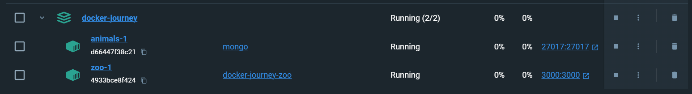
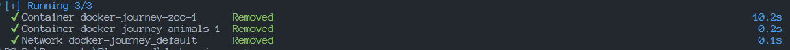

# Docker Container App 

[![Contributors][contributors-shield]][contributors-url]
[![Forks][forks-shield]][forks-url]
[![Stargazers][stars-shield]][stars-url]
[![Issues][issues-shield]][issues-url]
[![MIT License][license-shield]][license-url]
[![LinkedIn][linkedin-shield]][linkedin-url]

## Building with

- [![Docker][Docker]][Docker-url]
- [![Node][Node]][Node-url]
- [![Express][Express]][Express-url]

## Docker first steps

See all images in the docker app
```sh
    docker images
```

To download the later images e.g. node images for this example
```sh
    docker pull node
```

If you want choose a version, only needs add the version after :
```sh
    docker pull node:22
```

You can download as many images as you want.
```sh
    docker pull node:18
    docker pull node:20
    docker pull node:22
```

As you can download an image you can delete that one too, with the follow command
```sh
    docker image rm node:22
```

## Containers

Now, we are learning how create and run a container in docker, we are gonna using the mongo images

Download the images in docker
```sh
    docker pull mongo
```

We will create a container, this command returns an image id
```sh
    docker create mongo 
    # 3c0a93b1f151989ff0f4cbcb560193cdb155231240f77f056335ba91ebf0a6f0
```

Now, we run the container
```sh
    # docker start <id>
    docker start 3c0a93b1f151989ff0f4cbcb560193cdb155231240f77f056335ba91ebf0a6f0
```

To know information about the container
```sh
    docker ps
    docker ps -a # Container info, including the containers that are not running
```

As you cant start a containers you can stop them
```sh
    docker stop
``` 
 
You can create a container with a custom name
```sh
    # docker create --name <custom name> <image>
    docker create --name monguito mongo
```

## Port mapping
Now, the container is running and contain mongo as image, but this is not accessible in out computer
we need to expose a port in order to communicate with the container
```sh
    # -p[port in out computer]:[port of the application]
    docker create -p27017:27017 --name monguito mongo
```

## Logs
In order to see the logs that the container is doing
```sh
    docker logs monguito --follow
```

The previous commands works if you want create step by step but you can run only one line and execute the tree commands
```sh
    docker run -d mongo #-d to return the console
    docker run --name monguito -p27017:27017 -d mongo
```

## Instant

Now, we are going to create an instant of the mongo with a container and variables of environment
```sh
    docker create -p27017:27017 --name monguito -e MONGO_INITDB_ROOT_USERNAME=cavidev -e MONGO_INITDB_ROOT_PASSWORD=admin mongo
```

## Networks 

in order to communicate containers, we need create a network with the follow command

```sh
    docker network create mired
    docker network ls # to see the networks
    docket network rm mired # to delete
```

Once we have our network create, we can run the follow command to create a image
```sh
    # Please see the Dockerfile first
    docker build -t miapp:1 .
```

now, we are creating the mongo container inside of the "mired" network

```sh
docker create -p27017:27017 --name monguito --network mired -e MONGO_INITDB_ROOT_USERNAME=cavidev -e MONGO_INITDB_ROOT_PASSWORD=admin mongo
```

now, we are creating a container with the images that we previous build 

```sh
docker create -p3000:3000 --name chanchito --network mired miapp:1
```

## Using docker compose
please see the file docker-compose.yml
```sh
    docker compose up
```


### Deleting docker compose
```sh
    docker compose down
```


## Volumes

// docker-journey.svg?style=for-the-badge
[created-at-shield]: https://img.shields.io/github/created-at/cavidev/docker-journey
[repo-url]: https://github.com/cavidev/docker-journey/graphs/contributors

[contributors-shield]: https://img.shields.io/github/contributors/cavidev/docker-journey.svg?style=for-the-badge
[contributors-url]: https://github.com/cavidev/docker-journey/graphs/contributors
[forks-shield]: https://img.shields.io/github/forks/cavidev/docker-journey.svg?style=for-the-badge
[forks-url]: https://github.com/cavidev/docker-journey/network/members
[stars-shield]: https://img.shields.io/github/stars/cavidev/docker-journey.svg?style=for-the-badge
[stars-url]: https://github.com/cavidev/docker-journey/stargazers
[issues-shield]: https://img.shields.io/github/issues/cavidev/docker-journey.svg?style=for-the-badge
[issues-url]: https://github.com/cavidev/docker-journey/issues
[license-shield]: https://img.shields.io/github/license/cavidev/docker-journey.svg?style=for-the-badge
[license-url]: https://github.com/cavidev/docker-journey/blob/master/LICENSE.txt
[linkedin-shield]: https://img.shields.io/badge/-LinkedIn-black.svg?style=for-the-badge&logo=linkedin&colorB=555
[linkedin-url]: https://linkedin.com/in/carlosmariovillafuerte/

[Docker]: https://img.shields.io/badge/Docker-2496ED?style=plastic&logo=docker&logoColor=white
[Docker-url]: https://www.docker.com/
[Express]: https://img.shields.io/badge/Express.js-000000?style=plastic&logo=express&logoColor=white
[Express-url]: https://expressjs.com/
[Node]: https://img.shields.io/badge/Node.js-5FA04E?style=plastic&logo=nodedotjs&logoColor=white
[Node-url]: https://nodejs.com/